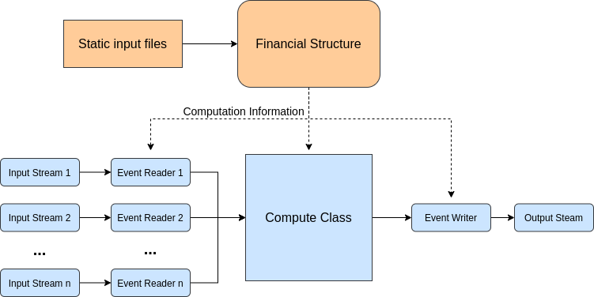

Financial Module rework
=======================

# Overview 
Multiple profiling studies showed that the Financial Module (FM) of the Oasis Framework was the main bottleneck of portfolio analysis, taking in some cases more than 95 % of the total computation time. 
For its simplicity and excellent computation speed, we chose to reimplement the FM in Python using Numpy and Numba. After writing a simple implementation script, a detailed analysis helps us to identify that the two main bottlenecks were the management of the loss arrays and checking to see if a computation was needed. We took an iterative approach to tackle the issue by first storing the loss in big arrays instead of objects, and second creating an algorithm to order dynamically the node computations activating only the one being impacted.
The result went beyond our expectations with a performance increase of the FM itself up to 400x. With this game changing improvement, the FM is no longer the main bottleneck and we achieved an overall speed up in performance of between 10x and 75x.

## Introduction
The Financial Module (FM) has long been identified as the main bottleneck of portfolio analysis in Oasis Loss Modelling Framework. As shown again recently in a study conducted by NAG for Allianz Re, the FM c++ code is technically well written and doesn’t contain major room for incremental improvement. This was one more proof that only a complete redesign of the module could result in the performance improvement we targeted (~10x). After explaining our choice of technologies, we will detail our redesign process and conclude with the result of this rework.

## Technologies: Python, Numpy, Numba
The choice of Python to improve performance over c++ can sound quite strange at first. Indeed, c++ is known to be one of the faster languages today compared to Python, which has the reputation of being slow for computation. However, in recent years, the development of Numpy has propelled the language among the most used in the scientific computation community. We will be particularly interested by its capacity to perform very optimised vector operations. 

More recently, Numba, a module that translate Python code into c++ at runtime, has allowed programmers to obtain both the simplicity of Python and the speed of c++. Finally, team members had some previous conclusive experiences with those modules, removing part of the learning curve and speeding up the whole process.

## Redesign: A three steps process
The redesign process we followed contains 3 main steps. First, we write a naive implementation, only following good coding principles, then we start profiling the code with some dummy and real data. Then we adapt and refine the code to remove all performance bottlenecks. We will also see that the choice of python along with Numpy and Numba modules is facilitating both the iterative approach we follow and the use of the latest computing technologies.

# Implementation
As we decided to change coding language, we cannot completely base our knowledge of computation timing on the C++. Therefore, for the first step of the redesign in Python, we started by writing a simple implementation following just few basic principles that minimize the time spent performing actual computations:

1. Computation must be performed only once:
To achieve this we separated the computation in two steps. First, we compute all the common values (across events) into a financial structure directly usable in the second step that will perform the actual computation of the events. This Financial structure can also be shared across multiple FM processes (saving substantial RAM) thanks to Numpy save and load functions that use nativelly “shared memory”.

2. Perform elementary computation on vectors
Vector computation allows for SIMD technology to kick in saving computation time. It is also natively present when using Numpy arrays.

## Profiling 
Achieving our first implementation allows us to start the profiling step and have a concrete idea of where the time is spent during the computation. Using both dummy and real anonymized data, the result showed that our implementation of policies, aggregation of loss and back-allocation using vectors was very performant and taking less that 1% of the total time. On the contrary, the most time was spent creating, deleting or copying vectors 95% and checking if a computation was needed 5%.
This means that we will need to do two adjustments to our implementation:
1. Reuse vectors and minimize theirs copy
2. modify the algorithm to keep track of computation to be done rather than checking for each node if there is a need to compute.

## Final redesign and refinement

In order to fulfil our two new requirements, we needed to change the basic data structures we use to store results during the computation.
1. To tackle the first issue, instead of using the classic objects approach like in the c++ implementation, everything will be stored in big Numpy arrays that will be reused along the computation.
Each node keeps a reference to its loss only by using a pointer. This means that if the loss stays the same we can just copy the pointer not the whole vector.
2. For the second issue, we implemented a dynamic queue where each activated node pushes the next level node that will need to be computed. When computing events only nodes in the input from the gulcalc are activated and we then only traverse nodes that have losses.
## Results
First let’s talk about the evolution of the performance of fmpy itself when run as a single process on a single core. We used an anonymized portfolio containing 100k Locations with only basic financial terms and 5 samples. We ran the output of the Ground Up Loss (GUL)  through the different versions.

> version 1: simple implementation took around 200 minutes

> version 2: with redesign 1 (big arrays and pointers) took around 5 minutes

> version 3: with both redesign took around 30 s

As a reference for this test the c++ FM took around 22 minutes
Thanks to our final redesign we got a 400x speed up from our simple approach and we show that this new implementation performs very well when compared to the old one for this test.
After this promising isolated test, we need to evaluate the performance of the new FM when plugged with the other components and with multiple processes in parallel. For this new series of tests, we used Canadian flood Guy Carpenter model on a 38 cores machine with 80G RAM. Below is the summary of the results.

| Portfolio name | Number of locations | Number of samples | fmcalc (mins) | FM Python (mins) |
|----------------|---------------------|-------------------|---------------|------------------|
| CAFL_10k       | 10,000              | 5                 | 1             | 0.7              |
| CAFL_10k       | 10,000              | 100               | 6.5           | 1                |
| CAFL_100k      | 100,000             | 5                 | 33            | 3.5              |
| CAFL_100k      | 100,000             | 100               | 375           | 5                |
| CAFL_1M        | 1,000,000           | 5                 | 195           | 30               |
| CAFL_1M        | 1,000,000           | 100               | 2,100         | 41               |
| CAFL_3         | 283,701             | 100               | 380           | 14               |
| CAFL_4         | 838,282             | 100               | 474           | 50               |
| CAFL_6_Corr    | 46,082              | 2,000             | 1,000         | 18               |

Performances of the new FM are excellent. We get a big overall speed up on big analysis from 10X to 75x. A deeper analysis on specifically the timings of the FM component even shows a performance increase of 400x when the number of samples is high compared to the number of locations.

## Conclusion
Our choice of technologies (Python, Numpy, Numba) proved to be very fruitful as it provided us with a good balance between simplicity of implementation and speed of computation.
In terms of performance, the new FM went beyond our expectation. The module itself is going between 50 and 400 times faster and the overall time of an analysis has been reduced between 10 and 50 times.
Moreover, our redesign process based on 3 steps, first going with a naive approach to be able to then specifically target bottlenecks and finally do a quick series of iterative improvements helped us to complete this successful proof of concept in under 3 months. 
This new implementation will be available as an option in production for experienced users for the release of November 2020 and we target to have a complete replacement for everybody in the coming quarter. 

# Architecture Design 

Manager is the high level entry point to run an FM computation. It orchestrate the different modules together in order to process the events coming in.
Each event is read one at a time from available input streams, we then compute the result and write it to the output stream.

The basic idea of the architecture of fm is that, in each event, we only compute nodes that need it.
when an event is read we start by adding the node_id corresponding to each item in a "computes" queue.
During the bottom up part, where losses are aggregated to higher levels,
we compute the loss of a node and then add its parent node in the queue.
we also add the node to the list of active children for the parent node.
This way the parent node only aggregate the loss of active children.  
During the back-allocation, the process is repeated but this time
its parent node that add its children to the compute queue.

Overall the fm computation is done in two steps:
1. creation of the shared static financial structure files.
2. event computation

## Financial Structure

The purpose of this module is to parse the static input financial structure and consolidate the information
into simple objects ready to be use by the compute function.
The idea is to factorise all the computation and logic that can be done at this step
and prepare everything possible to have a generic way to handle the computation for each item.

the object created during the financial structure step are all numpy ndarray.
this present many advantages.

* numpy provide an easy way to have them stored
* They can be loaded as a shared memory object for all the compute processes which greatly reduce memory usage.
* they are very fast and compact.

In particular, those are prefered to the numba dictionary and list even when it would be simpler to use
because they are way faster at the moment (early 2021).
This means that all the reference from an objet to other ones need to be done via a pointer like logic.
For example, the node ids of the parents of a node is reference in node_array with a length (parent_len) and
the index of the first parent id in node_parent_array.

### inputs

the necessary static input for the Financial Module are expected to be in the same folder
with the extantion '.bin' for binaries and '.cvs' for text files:

* fm_programme: the basic hierarchy of nodes organized by level and aggregation id
* fm_policytc: the policy id to apply to each node and layer described in the programme
* fm_profile or fm_profile_step: the profile (detailed values) of each policy id
* fm_xref: the mapping between result items and the output ID

Additionally if %tiv policies are present, those two extra files will be needed
* items: link between item_id and coverage_id 
* coverage: link between coverage_id and TIV

Inputs are read directly using numpy.fromfile, with named dtype specific to each fine name.
This allow to access each value in a row like a dictionary
and also provide a compatible interface for the two profile options
We make a realistic assumption that the input and output data will fit in memory.

### outputs
The transform static information that will be needed to build and execute the computation for each event

- **compute_info**:  
  contain the general information on the financial structure such as
  the allocation rule, the number of levels and whether there is stepped policy 
  it also contains the length of all the other ndarray  
- **nodes_array**:  
  all the static information about a node such as level_id, agg_id, number of layers and number of policy.
  Reference to its parents, children, profiles and different loss array 
- **node_parents_array**:  
  contain the index of parent node in node_array. 
- **node_profiles_array**:  
  contain the index of the node profile in fm_profile
- **output_array**:  
  contains the item_id of the output losses of each layer of a node (generated from xref) 
- **fm_profile**:
  contain the final version of all the policies in the original fm_profile
  (for example we compute the real tiv in order replace all %tiv policy value)

## Computation
The computation of the loss itself can only be done after the financial structure creation step.

The manager module will then first load this shared structure and then create all the dynamic arrays
* **losses** and **loss_indexes**: arrays to reference and store all losses
* **extras** and **extra_indexes**: arrays to reference and store the extra values
  such as deductible, under_limit and over_limit
* **children**: array of active children for each parant node
* **computes**: contains the index of all the nodes to compute

One thing to node with this architecture is that a node doesn't really 'own' its different losses.
It only has a reference to it via loss_indexes. This is very important as it allows us to share the array between nodes
if they happen to be the same. As we only copy the reference,
this drastically reduce the amount of data copy to be made in several cases.
* when a parent node has only one active child then the aggregation of losses is not needed,
   the parent node sum_loss will simply point to its children il_loss.
* when a node has a pass through profile (id 100), it's il_loss will point to its sum_loss
* during the back allocation if a parent has only one child,
   the ba_loss of the child will simply point to the ba_loss of the parent

once those structures are created, the manager will orchestrate the prossess event by event.
1. an event is read, all the item of the event are place in the compute queue.
2. an incremental pointer to computes 'compute_i' tracts which node need to be computed.  
   the computation itself starts with the bottom up step.  
   for each node, we aggregate the sub loss, apply the profile and put the parent node in the queue.  
   if the value it points to is 0 we are at the end of the level and can go to the next one.  
   then depending on rule we continue the same logic for the back allocation,
   only this time it goes from parent to children
3. the stream writer read the last level of 'computes' and write each active item and its loss to the output stream

### Policies
The policy module contains all the function associated to the supported policy.
They all take the same numpy array as input and act directly on them (inplace).

signature: `calcrule_i(policy, loss_out, loss_in, deductible, over_limit, under_limit)`
loss is present in two array because in some case we want to keep the sum value before the calc rule is applied.
(if it is not the case the array are in fact the same object)

### Stream
the stream module is responsible for the parsing and writing of gul and fm stream.
the Stream reader is able to read from multiple stream using the selector module of python.
