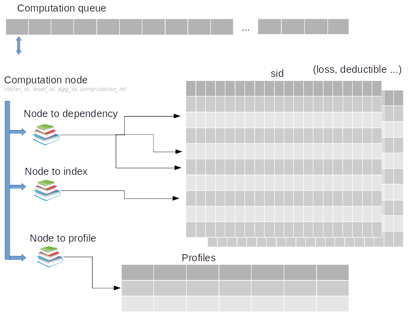

Financial Module rework
=======================

# Overview 
Multiple profiling studies showed that the Financial Module (FM) of the Oasis Framework was the main bottleneck of portfolio analysis, taking in some cases more than 95 % of the total computation time. 
For its simplicity and excellent computation speed, we chose to reimplement the FM in Python using Numpy and Numba. After writing a simple implementation script, a detailed analysis helps us to identify that the two main bottlenecks were the management of the loss arrays and checking to see if a computation was needed. We took an iterative approach to tackle the issue by first storing the loss in big arrays instead of objects, and second creating an algorithm to order dynamically the node computations activating only the one being impacted.
The result went beyond our expectations with a performance increase of the FM itself up to 400x. With this game changing improvement, the FM is no longer the main bottleneck and we achieved an overall speed up in performance of between 10x and 75x.

## Introduction
The Financial Module (FM) has long been identified as the main bottleneck of portfolio analysis in Oasis Loss Modelling Framework. As shown again recently in a study conducted by NAG for Allianz Re, the FM c++ code is technically well written and doesn’t contain major room for incremental improvement. This was one more proof that only a complete redesign of the module could result in the performance improvement we targeted (~10x). After explaining our choice of technologies, we will detail our redesign process and conclude with the result of this rework.

## Technologies: Python, Numpy, Numba
The choice of Python to improve performance over c++ can sound quite strange at first. Indeed, c++ is known to be one of the faster languages today compared to Python, which has the reputation of being slow for computation. However, in recent years, the development of Numpy has propelled the language among the most used in the scientific computation community. We will be particularly interested by its capacity to perform very optimised vector operations. 

More recently, Numba, a module that translate Python code into c++ at runtime, has allowed programmers to obtain both the simplicity of Python and the speed of c++. Finally, team members had some previous conclusive experiences with those modules, removing part of the learning curve and speeding up the whole process.

## Redesign: A three steps process
The redesign process we followed contains 3 main steps. First, we write a naive implementation, only following good coding principles, then we start profiling the code with some dummy and real data. Then we adapt and refine the code to remove all performance bottlenecks. We will also see that the choice of python along with Numpy and Numba modules is facilitating both the iterative approach we follow and the use of the latest computing technologies.

# Implementation
As we decided to change coding language, we cannot completely base our knowledge of computation timing on the C++. Therefore, for the first step of the redesign in Python, we started by writing a simple implementation following just few basic principles that minimize the time spent performing actual computations:

1. Computation must be performed only once:
To achieve this we separated the computation in two steps. First, we compute all the common values (across events) into a financial structure directly usable in the second step that will perform the actual computation of the events. This Financial structure can also be shared across multiple FM processes (saving substantial RAM) thanks to Numpy save and load functions that use nativelly “shared memory”.

2. Perform elementary computation on vectors
Vector computation allows for SIMD technology to kick in saving computation time. It is also natively present when using Numpy arrays.

## Profiling 
Achieving our first implementation allows us to start the profiling step and have a concrete idea of where the time is spent during the computation. Using both dummy and real anonymized data, the result showed that our implementation of policies, aggregation of loss and back-allocation using vectors was very performant and taking less that 1% of the total time. On the contrary, the most time was spent creating, deleting or copying vectors 95% and checking if a computation was needed 5%.
This means that we will need to do two adjustments to our implementation:
1. Reuse vectors and minimize theirs copy
2. modify the algorithm to keep track of computation to be done rather than checking for each node if there is a need to compute.

## Final redesign and refinement

In order to fulfil our two new requirements, we needed to change the basic data structures we use to store results during the computation.
1. To tackle the first issue, instead of using the classic objects approach like in the c++ implementation, everything will be stored in big Numpy arrays that will be reused along the computation.
Each node keeps a reference to its loss only by using a pointer. This means that if the loss stays the same we can just copy the pointer not the whole vector.
2. For the second issue, we implemented a dynamic queue where each activated node pushes the next level node that will need to be computed. When computing events only nodes in the input from the gulcalc are activated and we then only traverse nodes that have losses.
## Results
First let’s talk about the evolution of the performance of fmpy itself when run as a single process on a single core. We used an anonymized portfolio containing 100k Locations with only basic financial terms and 5 samples. We ran the output of the Ground Up Loss (GUL)  through the different versions.

> version 1: simple implementation took around 200 minutes

> version 2: with redesign 1 (big arrays and pointers) took around 5 minutes

> version 3: with both redesign took around 30 s

As a reference for this test the c++ FM took around 22 minutes
Thanks to our final redesign we got a 400x speed up from our simple approach and we show that this new implementation performs very well when compared to the old one for this test.
After this promising isolated test, we need to evaluate the performance of the new FM when plugged with the other components and with multiple processes in parallel. For this new series of tests, we used Canadian flood Guy Carpenter model on a 38 cores machine with 80G RAM. Below is the summary of the results.

| Portfolio name | Number of locations | Number of samples | fmcalc (mins) | FM Python (mins) |
|----------------|---------------------|-------------------|---------------|------------------|
| CAFL_10k       | 10,000              | 5                 | 1             | 0.7              |
| CAFL_10k       | 10,000              | 100               | 6.5           | 1                |
| CAFL_100k      | 100,000             | 5                 | 33            | 3.5              |
| CAFL_100k      | 100,000             | 100               | 375           | 5                |
| CAFL_1M        | 1,000,000           | 5                 | 195           | 30               |
| CAFL_1M        | 1,000,000           | 100               | 2,100         | 41               |
| CAFL_3         | 283,701             | 100               | 380           | 14               |
| CAFL_4         | 838,282             | 100               | 474           | 50               |
| CAFL_6_Corr    | 46,082              | 2,000             | 1,000         | 18               |

Performances of the new FM are excellent. We get a big overall speed up on big analysis from 10X to 75x. A deeper analysis on specifically the timings of the FM component even shows a performance increase of 400x when the number of samples is high compared to the number of locations.

## Conclusion
Our choice of technologies (Python, Numpy, Numba) proved to be very fruitful as it provided us with a good balance between simplicity of implementation and speed of computation.
In terms of performance, the new FM went beyond our expectation. The module itself is going between 50 and 400 times faster and the overall time of an analysis has been reduced between 10 and 50 times.
Moreover, our redesign process based on 3 steps, first going with a naive approach to be able to then specifically target bottlenecks and finally do a quick series of iterative improvements helped us to complete this successful proof of concept in under 3 months. 
This new implementation will be available as an option in production for experienced users for the release of November 2020 and we target to have a complete replacement for everybody in the coming quarter. 

# Architecture Design 

Manager is the high level entry point to run an FM computation. It orchestrate the different modules together in order to process the events coming in.
Each event is read one at a time from the input stream, we then compute the result and write it to the output stream.

* run_synchronous: processing one event at a time
* run_threaded: threaded mode using queue as synchronization tools.
* run_ray: mode using ray to load balance events

## Financial Structure

The purpose of this module is to parse the static input financial structure and consolidate the information into simple object ready to be use by the compute function. The idea is to factorise all the computation and logic that can be done at this step and prepare everything possible to have a generic way to handle the computation for each item.

During the computation, computation data (loss, deductible, over limit, not null ...) will separated into 3 buckets (input, temp, output). Each computation node will then be assigned a bucket and an index and the values for this node will then be store (during the computation) into a big matrix where the row will correspond to their index.

A computation node then consist of a node id (layer, level, agg) and a computation id that determine what will be done. In addition to that several dictionaries(map), can provide additional information needed for the computation step such as dependencies or profile

this structure present a number of advantage:

* the separation into 3 buckets minimize the data transfer at the interface of the computation. only inputs are needed in only outputs are passed out.
* input and output format are just numpy array that are well supported and could be passed or retrieved by other processes.
* access to any node result is done with a O(1) complexity
* aggregation that are just intermediary in the program tree structure with no computation can take the index of their unique child dependency and cost no computation.
* new type of computation can be simply added to the generic compute structure. A computation node is simply a functional step with some input and some output.
* data are stored as np.arrays that perform well with the most common operation we do sums and multiplications
* in case of bug or error, all the intermediary result could easily be stored for investigation.

### inputs

the necessary static input for the Financial Module are expected to be in the same folder and are:

* fm_programme.bin: the basic hierarchy of nodes organized by level and aggregation id
* fm_policytc.bin: the policy id to apply to each node and layer described in the programme
* fm_profile.bin (or fm_profile_step.bin not implemented yet): the profile (detailed values) of each policy id
* fm_xref.bin: the mapping between result items and the output ID

Inputs are read directly using numpy.fromfile, with named dtype specific to each fine name. This allow to access each value in a row like a dictionary and also provide a compatible interface for the two profile options
We make a realistic assumption that the input and output data will fit in memory.

### outputs
The transform static information that will be needed to build and execute the computation for each event

* compute_queue: list of all the computation step to execute to compute an event (ex: profile aggregation step, back-allocation)
* node_to_index: node to (bucket, index) mapping for each node needed to perform the computation. in this context an item in program can correspond to several nodes in the mapping, one node will be for the profile step others for the back allocation for example.
* node_to_dependencies: map to list of node that are needed for this step computation.
* node_to_profile: node to profile mapping
* output_item_index: output id to np array index mapping. needed to associate output id to the computation result
* storage_to_len: dictionary of the size needed for each bucket
* options: computation option (is deductible computation needed, do we need to store intermediary sum ...)
* profile: numpy ndarray of fm_profile.bin

## Computation
Computation module implement the actual computation of each event. It create all the numpy array necessary for the computation and execute one by one all the step present in the computation queue. each step is treated generically as a simple step to perform using the node computation id without pre-supposition of what has been done before. The correct ordering of the computation step are performed once, before the computation by the financial structure step.

so far there is far type of step:
* PROFILE: sum all sub-node array if present (loss, deductibles, over_limit, underlimit) then apply the calcrule inplace.
* IL_PER_GUL: take the final IL and divide it by the sum of all input gul.
* IL_PER_SUB_IL: take the a item back-allocated IL and divide it by the stored sum of IL computed before calc rule was applied. (this will serve as common basis for the back allocation of all sub-items)
* PROPORTION: multiply the array loss (il) by the factor computed in IL_PER_GUL or IL_PER_SUB_IL
* COPY: use to copy a vector from an index to an other (copy to output bucket in a0 ba rule for example)

event_computer is a callable that takes event input from input queue, compute the output and put it in the output queue.

### Policies
he policy module contains all the function associated to the supported policy they all take the same numpy array as input and act directly on them (inplace).

signature: `calc(policy, loss_out, loss_in, deductible, over_limit, under_limit)` loss is present in two array because in some case we want to keep the sum value before the calc rule is applied. (if it is not the case the array are in fact the same object)

### Stream
the stream module is responsible for the parsing and writing of gul and fm stream. the gul stream in parse and transformed into the numpy input array. the fm stream is written from the numpy output array. In the threaded mode reader and writer work in combination with the event_computer using Queues.
