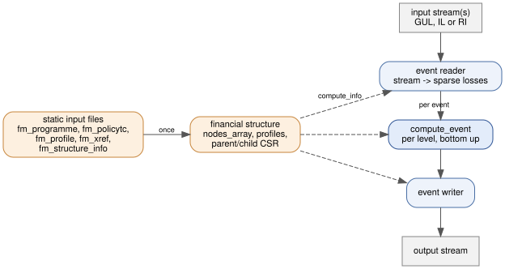
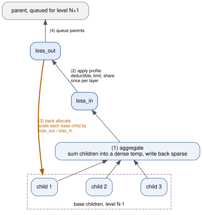
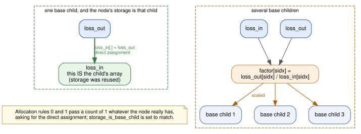
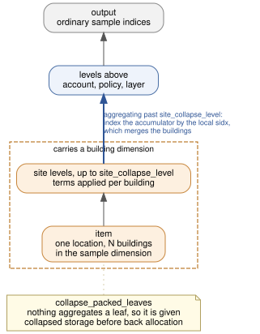

# FM Sparse Computation - Technical Documentation

This document provides detailed technical documentation for the Financial Module (FM) sparse computation implementation. It covers the data structures, algorithms, and computation flow used to calculate insured losses.

## Table of Contents

1. [Overview](#overview)
2. [Data Structures](#data-structures)
3. [Computation Flow](#computation-flow)
4. [Aggregation](#aggregation)
5. [Profile Application](#profile-application)
6. [Back Allocation](#back-allocation)
7. [Building Packing](#building-packing)
8. [Stream I/O](#stream-io)
9. [Memory Management](#memory-management)
10. [Performance Considerations](#performance-considerations)

---

## Overview

The FM sparse computation engine processes insurance/reinsurance losses through a hierarchical node structure.
It reads ground-up losses (GUL), insurance loss (IL) or previous cycle or re-insurance loss (RI) from an input stream,
applies financial terms (deductibles, limits, shares) at each level of the hierarchy,
and outputs the computed insured losses.

### Key Design Principles

1. **Sparse Storage**: Only non-zero loss samples are stored, reducing memory usage significantly
2. **Bottom-Up Traversal**: Computation proceeds from items (leaves) up to the root
3. **In-Place Modification**: Results are computed in-place to minimize memory allocation
4. **JIT Compilation**: Critical functions use Numba for near-native performance

### Module Structure

```
fm/
├── manager.py          # Entry point, orchestrates the computation
├── financial_structure.py  # Parses static input files into computation-ready arrays
├── compute_sparse.py   # Core computation engine
├── back_allocation.py  # Loss distribution back to children
├── stream_sparse.py    # Binary stream reading/writing
├── policy.py           # Financial term calculations (calc rules)
├── policy_extras.py    # Calc rules with extras tracking (deductible, over_limit, under_limit)
├── common.py           # Shared constants and data types
├── cli.py              # fmpy command line entry point
├── compare.py          # Compare two FM output streams
└── portfolio_complexity.py  # Report on the shape of a portfolio's structure
```

---

## Data Structures

### CSR-Inspired Sparse Storage

The computation uses a Compressed Sparse Row (CSR) inspired format to store loss data efficiently.
This is crucial because most samples may have zero loss, and storing all samples would waste memory.

```
For N nodes, each with variable number of samples:

sidx_indptr:  [0, 3, 7, 10, ...]  # Pointers to start of each node's data
sidx_val:     [-3, -1, 5, -3, -1, 2, 8, ...]  # Sample indices
loss_val:     [100, 50, 25, 200, 100, 75, 30, ...]  # Corresponding losses

Node 0: sidx_val[0:3] = [-3, -1, 5], loss_val[0:3] = [100, 50, 25]
Node 1: sidx_val[3:7] = [-3, -1, 2, 8], loss_val[3:7] = [200, 100, 75, 30]
```

### Sample Index (sidx) Values

Special negative indices carry metadata:

| sidx | Constant | Meaning |
|------|----------|---------|
| -5 | MAX_LOSS_IDX | Maximum possible loss |
| -4 | CHANCE_OF_LOSS_IDX | Probability of non-zero loss |
| -3 | TIV_IDX | Total Insured Value |
| -2 | (ignored) | Standard deviation |
| -1 | MEAN_IDX | Mean/expected loss |
| 1..N | (samples) | Monte Carlo sample indices |

### Node Array Structure

Each node in `nodes_array` contains:

```python
nodes_array_dtype = np.dtype([
    ('node_id', np.uint64),          # Unique node identifier
    ('level_id', oasis_int),         # Hierarchy level (1 = items)
    ('agg_id', oasis_int),           # Aggregation ID from fm_programme
    ('layer_len', oasis_int),        # Number of output layers
    ('cross_layer_profile', oasis_int),  # True if one profile covers all layers
    ('profile_len', oasis_int),      # Number of profiles (may differ from layer_len)
    ('profiles', oasis_int),         # Index into node_profiles_array
    ('loss', oasis_int),             # Index into loss_indptr
    ('net_loss', oasis_int),         # Index for net loss storage
    ('extra', oasis_int),            # Index into extras_indptr (or null_index)
    ('is_reallocating', np.uint8),   # Node redistributes its loss to its children
    ('parent_len', oasis_int),       # Number of parents
    ('parent', oasis_int),           # Index into node_parents_array
    ('children', oasis_int),         # Index into children array
    ('output_ids', oasis_int),       # Index into output_array
])
```

Defined in `financial_structure.py`.

### Computation Index Structure

The `compute_idx` tracks computation state:

```python
compute_idx_dtype = np.dtype([
    ('level_start_compute_i', int),  # Start of current level (for output)
    ('next_compute_i', int),         # End of current level / start of next
    ('compute_i', int),              # Current node being processed
    ('sidx_i', int),                 # Next sidx array index
    ('sidx_ptr_i', int),             # Next position in sidx_val
    ('loss_ptr_i', int),             # Next position in loss_val
    ('extras_ptr_i', int),           # Next position in extras_val
])
```

Defined in `common.py`.

### Extras Array

Extras track financial term effects for back allocation:

```python
extras_val[i] = [deductible, overlimit, underlimit]

# deductible: Amount deducted from loss
# overlimit:  Amount exceeding the policy limit
# underlimit: Remaining capacity (limit - loss)
```

---

## Computation Flow

### High-Level Algorithm

```
For each event:
    1. Read item losses from input stream into sparse arrays
    2. For each level (bottom to top):
        For each node at this level:
            a. AGGREGATE: Sum children losses
            b. APPLY PROFILE: Apply financial terms
            c. BACK ALLOCATE: Distribute results to base children
            d. QUEUE PARENTS: Add parents for next level
    3. Write output losses to stream
```

### Pipeline



The financial structure is built once from the static files; the reader, computation and
writer then run per event.

### Loss Flow Through One Node

Each node repeats the same four steps. Losses move up the hierarchy; the effect of the
terms comes back down.



With a single child the aggregation is skipped and the child's storage becomes the node's,
so `loss_in` already *is* the child's array. That is why back allocation can then assign
`loss_out` straight into it rather than computing a ratio.

### Level Traversal

The `computes` array acts as a queue:

```
Initial state (after reading items):
computes = [item1, item2, item3, 0, ...]
            ^compute_i       ^next_compute_i

After processing level 1:
computes = [item1, item2, item3, 0, parent1, parent2, 0, ...]
                                   ^compute_i        ^next_compute_i
```

The zero acts as a level delimiter. When `computes[compute_i] == 0`, we've finished the current level.

### Children Tracking

The `children` array tracks which children have been seen for each parent:

```
children[parent['children']] = count
children[parent['children'] + 1] = child1_id
children[parent['children'] + 2] = child2_id
...
```

---

## Aggregation

When a node has multiple children, their losses must be aggregated before applying financial terms.

### Algorithm

```python
def aggregate_children(node, children_count, ...):
    # Use dense temporary array for accumulation
    temp_node_loss.fill(0)

    for each child:
        child_sidx = sidx_val[child's range]
        child_loss = loss_val[child's range]

        for i, sidx in enumerate(child_sidx):
            temp_node_sidx[sidx] = True  # Mark as present
            temp_node_loss[sidx] += child_loss[i]  # Accumulate

    # Convert back to sparse storage
    for sidx in all_sidx:
        if temp_node_sidx[sidx]:
            sidx_val[ptr] = sidx
            loss_val[ptr] = temp_node_loss[sidx]
            ptr += 1
```

### Single Child Optimization

When a node has only one child, no aggregation is needed. The child's storage can be reused directly:

```python
if children_count == 1:
    storage_node = child  # Reuse child's arrays
else:
    storage_node = parent  # Create new storage
```

---

## Profile Application

Financial profiles define the calc rules (deductibles, limits, shares) applied at each node.

### Profile Types

1. **Per-Layer Profiles**: Each layer has its own profile
   - `profile_len == layer_len`
   - `cross_layer_profile = False`

2. **Cross-Layer Profiles**: One profile applies to merged layers
   - `cross_layer_profile = True`
   - Losses summed across layers, profile applied, then back-allocated

3. **Step Policies**: Multiple profile steps for one layer
   - `node_profile['i_start'] < node_profile['i_end']`
   - Steps applied sequentially

### Profile Application Flow

```python
for profile_i in range(profile_len):
    profile = get_profile(node, profile_i)

    if profile has steps (i_start < i_end):
        loss_in = current_loss
        loss_out = temp_array

        for step_i in range(i_start, i_end):
            calc(fm_profile[step_i], loss_out, loss_in, ...)

        # Back allocate results
        back_alloc(...)
```

### Calc Rules

The `calc` function applies financial terms based on `calcrule_id`:

| Rule | Description |
|------|-------------|
| 1 | Deductible and limit |
| 2 | Deductible, attachment, limit and share |
| 3 | Franchise deductible and limit |
| 12 | Deductible only |
| 14 | Limit only |
| ... | (see policy.py for full list) |

---

## Back Allocation

After applying financial terms at an aggregate level, results must be distributed back to individual items.

### Allocation Rules

| Rule | Description | Factor Calculation |
|------|-------------|-------------------|
| 0 | No allocation | Output at aggregate level only |
| 1 | Proportional to input | `factor = output / sum(original_input)` |
| 2 | Pro-rata (proportional to computed) | `factor = output / input` at each level |
| 3 | Alias of rule 2 | mapped to 2 on entry; the distinction is in the ground-up stage |

### Algorithm

```python
def back_alloc_a2(base_children_count, storage_is_base_child, ...):
    if base_children_count == 1 and storage_is_base_child:
        loss_in[:] = loss_out  # Direct assignment
    else:
        # Compute factor for each sample
        for sidx in node_sidx:
            factor[sidx] = loss_out[sidx] / loss_in[sidx]

        # Apply factor to each child
        for child in children:
            for sidx in child_sidx:
                child_loss[sidx] *= factor[sidx]
```



The direct assignment writes the post-profile loss straight to the node's input
storage, which is only correct when that storage belongs to the single base child.
`storage_is_base_child` says whether it does; a forced aggregation can give a node
one base child whose storage is somewhere else.

Rules 0 and 1 pass a count of `1` whatever the node really has, meaning "take the
direct assignment". The flag is set alongside it so the pair agrees — the two
arguments must describe the same node, or the caller asks for a state that has no
meaning.

### Extras Back Allocation

When tracking extras (deductible, overlimit, underlimit), allocation is more complex:

```python
# Deductible change
deductible_delta = extra_after - extra_before

if deductible_delta >= 0:
    # Deductible increased: allocate by loss
    ded_factor = delta / loss_in
else:
    # Deductible decreased: reallocated to loss
    if underlimit > 0:
        ded_factor = delta / underlimit  # By remaining capacity
    else:
        ded_factor = delta / deductible  # By existing deductible
```

The sign convention:
- Positive factor: additive (`child_value += factor * base`)
- Negative factor: multiplicative (`child_value *= -factor`)

### Layer Back Allocation

For cross-layer profiles, the merged result is distributed to layers:

```python
# loss_in = sum of all layers (merged)
# loss_out = after profile application

factor = loss_out / loss_in

for layer in layers:
    layer_loss_after = layer_loss_before * factor
```

---

## Building Packing

A location's buildings can arrive multiplexed into the sample dimension of a single item
rather than as one item each. The financial module applies the site levels' terms per
building and then collapses them.

### The packed sample index

An item carrying `N` buildings encodes building `b` (1-based), sample `s`, at
`sidx = (b - 1) * S + s`, and the negative specials at `sidx = local - (b - 1) * NUM_SPECIAL_SIDX`.
Building 1 is the identity encoding, so an item carrying one building is an ordinary item.

### Structure info

Generation writes `fm_structure_info.bin` (8 bytes) alongside the other static files:

| Field | Meaning |
|-------|---------|
| `site_collapse_level` | Last level whose aggregation key includes `risk_id`. `0` means no level does |
| `max_buildings` | Largest building count any one item carries |

Neither can be derived here: `fm_programme` levels are compacted, so which level is the last
risk-keyed one varies per portfolio, and the building counts live on the correlations table,
which the financial module does not read. `load_fm_structure_info` returns `(0, 1)` when the
file is absent, which is every structure generated without packing.

### Where the buildings collapse

Two paths, chosen in `manager.py` from the structure info:

**No level applies terms per building** — `site_collapse_level < max(1, start_level)`. The
reader sums the buildings away as it reads (`collapse_on_read`), storing each record at its
local sidx, and the computation sees an ordinary stream. `0` is the "no risk-keyed level"
marker rather than a level number, hence `max(1, ...)`.

**A site level does apply terms per building** — the building dimension is carried up to and
including `site_collapse_level`. `collapses_buildings()` reports when aggregating a child into
a node crosses that point; indexing the dense accumulator by the local sidx instead of the
packed one is what performs the merge, and the parent's sidx array comes out unpacked.



### Leaves

Nothing aggregates a leaf, so a packed leaf keeps its packed storage. With an allocation rule
above 0, back-allocation writes to the leaves and the output is read from them, so they would
emit packed sample indices. `collapse_packed_leaves()` gives them collapsed storage once their
terms have been applied.

The storage cannot be collapsed where it lies: the arrays are one arena and a node's range is
`[sidx_indptr[i], sidx_indptr[i + 1])`, whose end is the next node's start. Fresh storage is
appended at the bump pointer and the leaf repointed, exactly as an aggregation does for a
parent. The old slice becomes dead space that the capacity bound already allows for.

This runs before back-allocation, which is what keeps back-allocation unchanged: the factor is
looked up by sample index, and a collapsed leaf's indices line up with its node's.

### Arena capacity

`packable_node_len` counts the nodes at or below the collapse level, and is `0` unless the
structure is packed. Each such node needs room for its own packed blocks, plus the collapsed
copy appended rather than shrunk in place:

```python
extra_slots = packable_nodes * max_buildings * max_sidx_count
extra_layer_slots = extra_slots * (max_layer + 1)   # one slice per layer, plus net_loss
```

`sidx_val` takes `extra_slots`; `loss_val` and `extras_val` take `extra_layer_slots`, since a
packable node may carry several layers and the net-loss slice lives in `loss_val` beside them.
`sidx_indptr` gains one entry per packable node, because each appended slice is a further
allocation.


---

## Stream I/O

### Input Stream Format

```
Header:
  stream_type: int32 (GUL_STREAM_ID, FM_STREAM_ID, or LOSS_STREAM_ID)
  max_sidx: int32

Per item:
  event_id: int32
  item_id: int32
  [sidx: int32, loss: float32]*  # Repeated until delimiter
  delimiter: sidx=0, loss=0.0
```

### Reading State Machine

```
State: HEADER (item_id == 0)
    Read event_id, item_id
    Initialize node storage
    Transition to: DATA

State: DATA (item_id != 0)
    Read sidx, loss
    If sidx == 0: delimiter -> HEADER
    If sidx == -2: ignore (std dev)
    If sidx == -4: store in pass_through
    Else: add to sparse arrays
```

### Output Stream Format

Same format as input. The writer iterates through output nodes:

```python
for node in output_nodes:
    write(event_id, output_id)
    write(-5, max_loss)  # Special indices first
    write(-4, chance_of_loss)
    write(-3, tiv)
    write(-1, mean_loss)
    for sidx in positive_samples:
        if loss[sidx] > 0:
            write(sidx, loss[sidx])
    write(0, 0.0)  # Delimiter
```

---

## Memory Management

### Array Sizing

Arrays are pre-allocated based on worst-case estimates:

```python
max_sidx_count = max_sidx_val + EXTRA_SIDX_COUNT  # Per node
sidx_val_size = node_count * max_sidx_count
loss_val_size = loss_pointer_count * max_sidx_count
```

### Low Memory Mode

When `low_memory=True`, large arrays use memory-mapped files:

```python
if low_memory:
    sidx_val = np.memmap(path, mode='w+', shape=size, dtype=dtype)
else:
    sidx_val = np.zeros(size, dtype=dtype)
```

### Per-Event Reset

After each event, dynamic arrays are reset:

```python
def reset_variable(children, compute_idx, computes):
    computes[:compute_idx['next_compute_i']].fill(0)
    children.fill(0)
    compute_idx['next_compute_i'] = 0
```

---

## Performance Considerations

### Numba JIT Compilation

All critical inner loops use `@njit(cache=True)`:
- First run compiles and caches
- Subsequent runs use cached machine code
- `fastmath=True` enables SIMD optimizations

### Sparse vs Dense Trade-offs

| Operation | Sparse | Dense |
|-----------|--------|-------|
| Storage | O(nnz) | O(n) |
| Random access | O(log n) | O(1) |
| Iteration | O(nnz) | O(n) |
| Aggregation | Requires conversion | Direct |

The implementation converts sparse to dense for aggregation, then back to sparse for storage.

### Memory Access Patterns

- **Sequential access**: sidx_val, loss_val iteration
- **Random access**: temp_node_loss[sidx] during aggregation
- **Cache efficiency**: Process nodes in order to maximize locality

### Avoiding Python Overhead

- No Python objects in hot paths
- Pre-allocated arrays (no dynamic allocation in loops)
- Numba-compatible data types only

---

## Debugging Tips

### Error Handling

On computation error, `event_error.json` is written:

```json
{
    "event_index": 42,
    "event_id": 12345,
    "agg_id": 7,
    "node_level_id": 3
}
```

### Enabling Debug Output

Uncomment print statements in `compute_sparse.py`:

```python
# print('level', level, compute_node['agg_id'], ...)
# print('ba', child['level_id'], child['agg_id'], ...)
```

### Verifying Results

Use `compare.py` to compare two FM output streams:

```python
from fm.compare import compare_streams
result = compare_streams(gul_stream, fm_stream1, fm_stream2, precision=5)
```
