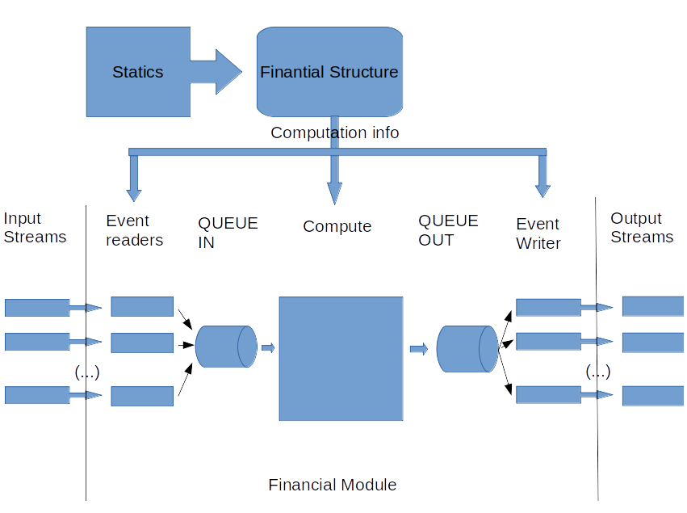

# Financial Module Architecture

## Manager
Manager is the high level entry point to run an FM computation.
It orchestrates the different modules together in order to process the events coming in.
There are several run mode:
- run_synchronous: processing one event at a time
- run_threaded: threaded mode using queue as synchronization tools.
- run_ray: mode using ray to load balance events

### synchronous mode
In synchronous mode, one event at a time is read from the input stream
then we computed the result and write it to the output stream.

This simple mode is mainly use for debugging as the other modes are more performant in general.
In this mode only one input and one output stream are possible.

### asynchronous modes 

 

This model can be use as base for a multi-thread, multi-process or cluster architecture
allowing a consistent architecture throw diverse scaling solutions.

By separating the reading and writing of the event from the computation itself and using Queues,
we prepare the work for other processes (gulcalc or other FM) to communicate directly between them.
This could remove the serialization, deserialization steps necessary when using pipes.

The queue_event_reader, event_computer and queue_event_writer are based on the classical
producer-consumer pattern. This model also limits the time spent waiting for IO.
We use a sentinel to indicate to the consumer that all events have been processed.

## Financial Structure
The purpose of this module is to parse the static input financial structure
and consolidate the information into simple object ready to be use by the compute function.
The idea is to factorise all the computation and logic that can be done at this step
and prepare everything possible to have a generic way to handle the computation for each item.

During the computation, computation data (loss, deductible, over limit, not null ...)
will separated into 3 buckets (input, temp, output).
Each computation node will then be assigned a bucket and an index
and the values for this node will then be store (during the computation) into a big matrix where the row
will correspond to their index.

A computation node then consist of a node id (layer, level, agg) and a computation id
that determine what will be done.
In addition to that several dictionaries(map), can provide additional information needed for the
computation step such as dependencies or profile

 

this structure present a number of advantage:
- the separation into 3 buckets minimize the data transfer at the interface of the computation.
only inputs are needed in only outputs are passed out.
- input and output format are just numpy array that are well supported and could be passed or retrieved
by other processes.
- access to any node result is done with a O(1) complexity
- aggregation that are just intermediary in the program tree structure with no computation
can take the index of their unique child dependency and cost no computation.
- new type of computation can be simply added to the generic compute structure.
A computation node is simply a functional step with some input and some output.
- data are stored as np.arrays that perform well with the most common operation we do 
sums and multiplications
- in case of bug or error, all the intermediary result could easily be stored for investigation. 

### inputs
the necessary static input for the Financial Module are expected to be in the same folder and are:
- fm_programme.bin: the basic hierarchy of nodes organized by level and aggregation id
- fm_policytc.bin: the policy id to apply to each node and layer described in the programme
- fm_profile.bin (or fm_profile_step.bin not implemented yet): the profile (detailed values) of each policy id
- fm_xref.bin: the mapping between result items and the output ID

Inputs are read directly using numpy.fromfile, with named dtype specific to each fine name.
This allow to access each value in a row like a dictionary
and also provide a compatible interface for the two profile options

We make a realistic assumption that the input and output data will fit in memory.

### outputs
The transform static information that will be needed to build and execute the computation for each event
 
- compute_queue: list of all the computation step to execute to compute an event (ex: profile aggregation step, back-allocation)
- node_to_index: node to (bucket, index) mapping for each node needed to perform the computation.
in this context an item in program can correspond to several nodes in the mapping, one node will be for the profile step
others for the back allocation for example.
- node_to_dependencies: map to list of node that are needed for this step computation.
- node_to_profile: node to profile mapping
- output_item_index: output id to np array index mapping. needed to associate output id
to the computation result
- storage_to_len: dictionary of the size needed for each bucket
- options: computation option (is deductible computation needed, do we need to store intermediary sum ...)
- profile: numpy ndarray of fm_profile.bin

## Computation
Computation module implement the actual computation of each event.
It create all the numpy array necessary for the computation and
execute one by one all the step present in the computation queue.
each step is treated generically as a simple step to perform using the node computation id
without pre-supposition of what has been done before.
The correct ordering of the computation step are performed once, before the computation
by the financial structure step.

so far there is far type of step:
- PROFILE: sum all sub-node array if present (loss, deductibles, over_limit, underlimit) then
apply the calcrule inplace.
- IL_PER_GUL: take the final IL and divide it by the sum of all input gul.
- IL_PER_SUB_IL: take the a item back-allocated IL and divide it by the stored sum of IL computed
before calc rule was applied. (this will serve as common basis for the back allocation of all sub-items)
- PROPORTION: multiply the array loss (il) by the factor computed in IL_PER_GUL or IL_PER_SUB_IL
- COPY: use to copy a vector from an index to an other (copy to output bucket in a0 ba rule for example)

event_computer is a callable that takes event input from input queue, compute the output and
put it in the output queue. 

## Policies
The policy module contains all the function associated to the supported policy
they all take the same numpy array as input and act directly on them (inplace). 

signature:
`calc(policy, loss_out, loss_in, deductible, over_limit, under_limit)`
loss is present in two array because in some case we want to keep the sum value before
the calc rule is applied. (if it is not the case the array are in fact the same object)

## Stream
the stream module is responsible for the parsing and writing of gul and fm stream.
the gul stream in parse and transformed into the numpy input array.
the fm stream is written from the numpy output array.
In the threaded mode reader and writer work in combination with the event_computer using
Queues.

## Queue
In order to prepare for a more distributed approach and also to reduce time spent waiting for io,
the main mode for the FM calc is to use several threads for input, output and computation.
In order to terminate gracefully in case of error, the standard python queue is over-writen to
implement a terminate function that will tell thread to stop if an error is caught.
