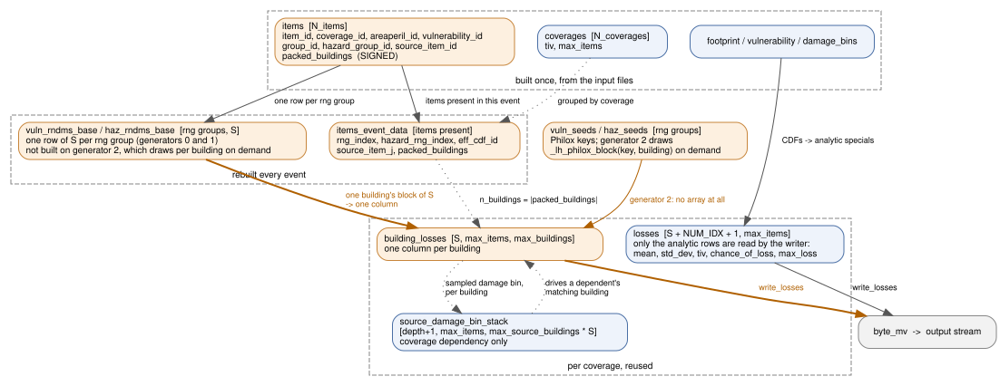
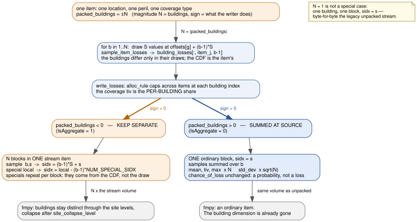
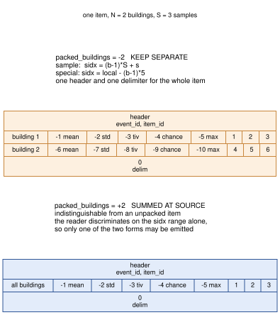

# GULMC — Ground-Up Loss Monte Carlo

## Overview

GULMC computes ground-up losses (GUL) for catastrophe risk models using full Monte Carlo
sampling. It processes events one at a time from a binary input stream: for each event, it
retrieves the hazard footprint, maps items to coverages, generates random numbers, computes
vulnerability CDFs, samples losses, and writes binary output.

All performance-critical code paths use Numba JIT compilation (`@nb.njit`).

## Module Structure

```
gulmc/
├── cli.py          # CLI entry point and argument parsing
├── common.py       # Numba-compatible data type definitions and constants
├── items.py        # Item loading and item_map generation
├── aggregate.py    # Aggregate vulnerability definitions and weight processing
├── manager.py      # Main orchestration: run(), event loop, and all Numba-compiled functions
└── README.md       # This file
```

Shared modules in `gul/`:
```
gul/
├── random.py       # Random number generation (Mersenne Twister, Latin Hypercube)
├── core.py         # Core math: get_gul(), compute_mean_loss(), split_tiv()
├── manager.py      # write_losses(), adjust_byte_mv_size()
└── utils.py        # binary_search()
```

## Data Flow

```
                       ┌──────────────────────────────────────────────────────┐
                       │                     run() setup                      │
                       │                                                      │
                       │  Load: items, coverages, correlations, vuln_array,  │
                       │        damage_bins, footprint index                  │
                       │  Build: item_map, areaperil_ids_map                  │
                       │  Pre-allocate: seeds, cdf cache, buffers             │
                       └───────────────────────┬──────────────────────────────┘
                                               │
                     ┌─────────────────────────▼─────────────────────────────┐
                     │              Event Loop (per event)                    │
                     │                                                       │
                     │  1. Read event_id from input stream                   │
                     │  2. get_event() → event_footprint                     │
                     │  3. process_areaperils_in_footprint()                 │
                     │     → areaperil_ids, haz_arr_i mapping, haz_pdf       │
                     │  4. reconstruct_coverages()                           │
                     │     → items_event_data, seeds, eff_cdf_ids            │
                     │  5. 2 sample draws + 2 correlation draws              │
                     │  6. Reset CDF cache lookup (Dict only, array reused)  │
                     │  7. compute_event_losses() [may loop for large events]│
                     │  8. Write output buffer to stream                     │
                     └───────────────────────────────────────────────────────┘
```

## Key Data Structures

### Items Table (`items`)

Structured numpy array built during setup by merging `items.bin` with `correlations.bin`.
Extended with sequential index fields for O(1) lookups:

| Field | Type | Description |
|---|---|---|
| `item_id` | int32 | Unique item identifier |
| `coverage_id` | int32 | Coverage this item belongs to |
| `areaperil_id` | areaperil_int | Area-peril identifier (may be uint64) |
| `vulnerability_id` | int32 | Vulnerability function id |
| `group_id` | int32 | Group for damage random seed generation |
| `hazard_group_id` | int32 | Group for hazard random seed generation |
| `group_seq_id` | int32 | Sequential index for group_id (O6) |
| `hazard_group_seq_id` | int32 | Sequential index for hazard_group_id (O6) |
| `peril_correlation_group` | int32 | Peril correlation group |
| `damage_correlation_value` | float | Damage correlation strength |
| `hazard_correlation_value` | float | Hazard correlation strength |
| `source_item_id` | int32 | Coverage dependency: the item whose sampled damage drives this one; 0 if independent |
| `packed_buildings` | int32 | **Signed.** Magnitude is how many buildings this item carries; a negative sign means they must reach the financial module as separate blocks. 1 is the unpacked case. See [Building packing](#building-packing) |

### Per-Event Item Data (`items_event_data`)

Structured array of type `items_MC_data_type`, populated per event by `reconstruct_coverages`:

| Field | Type | Description |
|---|---|---|
| `item_id` | int32 | Item identifier |
| `item_idx` | int32 | Index into the items table |
| `haz_arr_i` | int32 | Index into haz_arr_ptr for this item's hazard pdf |
| `rng_index` | int32 | Index into vuln_seeds / vuln_rndms_base |
| `hazard_rng_index` | int32 | Index into haz_seeds / haz_rndms_base |
| `intensity_adjustment` | int32 | Dynamic footprint intensity adjustment |
| `return_period` | int32 | Dynamic footprint return period |
| `event_rp` | int32 | Dynamic footprint return period of this event at the item's areaperil |
| `eff_cdf_id` | int32 | Sequential CDF group id for cache key construction (O5) |
| `source_item_j` | int32 | Coverage dependency: the source item's position within its coverage; < 0 if independent |
| `packed_buildings` | int32 | The signed building count, carried through from the items table |

### Vulnerability CDF Cache

A circular buffer that caches computed CDFs to avoid recomputation when multiple items
share the same vulnerability function and hazard conditions.

**Storage**: `cached_vuln_cdfs` — 2d array of shape `(Nvulns_cached, Ndamage_bins_max)`.
Pre-allocated once before the event loop (up to 200MB, configurable via `--vuln-cache-size`).
Reused across events without reallocation.

**Lookup**: `cached_vuln_cdf_lookup` — Numba Dict mapping `int64` keys to
`(slot_index, cdf_length)` tuples. Rebuilt (cleared) each event.

**Key encoding** (composite int64):
```
┌─────────────────────────────────┬─────────────────────────────────┐
│  upper 32 bits: eff_cdf_id      │  lower 32 bits: discriminator   │
└─────────────────────────────────┴─────────────────────────────────┘
```
- **Effective damage CDF**: `eff_cdf_id << 32 | 0xFFFFFFFF`
- **Per-bin vulnerability CDF**: `eff_cdf_id << 32 | haz_bin_id`

The `eff_cdf_id` is a sequential integer assigned per unique `(areaperil_id, vulnerability_id)`
pair during `reconstruct_coverages`. This avoids putting `areaperil_id` (potentially uint64)
in the cache key.

**Eviction**: circular (LRU-like). A write cursor advances through slots; when reusing a slot,
the old key is removed from the Dict. A reverse mapping (`cached_vuln_cdf_lookup_keys` list)
tracks which key occupies each slot.

## Core Functions (manager.py)

### `run(**kwargs)`

Main entry point. Loads all model data, sets up buffers, and runs the event loop.
Includes performance profiling instrumentation that prints per-phase timing to stderr.

### `process_areaperils_in_footprint(event_footprint, present_areaperils, dynamic_footprint)`

Filters the event footprint to retain only areaperils that have associated items.
Assigns a sequential `haz_arr_i` index (0, 1, 2, ...) to each retained areaperil, which is
used as the index into `haz_arr_ptr` for accessing the hazard intensity pdf.

### `reconstruct_coverages(...)`

Per-event preparation phase. Iterates all (areaperil, vulnerability) pairs in the footprint,
and for each mapped item:
- Computes hash-based random seeds (deduplicated by group using array lookups).
- Maps items to their coverage structures.
- Assigns `eff_cdf_id` for CDF cache key construction.

Uses pre-allocated arrays (`group_seq_rng_index`, `hazard_group_seq_rng_index`) for O(1)
group deduplication instead of per-event Numba Dict creation.

### `compute_event_losses(...)`

Core loss computation. For each coverage and item:
1. Retrieves hazard pdf via `haz_arr_i`.
2. Looks up or computes the effective damage CDF (and per-bin CDFs when
   `effective_damageability=False`), using the int64 cache key.
3. Computes mean loss statistics.
4. Samples losses using correlated or uncorrelated random values.
5. Writes results to the output byte buffer.

May return early (False) if the output buffer is full; the caller flushes and re-invokes.

### `cache_cdf(next_i, cdfs, lookup, keys, cdf, key)`

Stores a CDF in the circular cache. If the target slot is occupied, evicts the old entry
from the lookup Dict before overwriting.

## Building packing

A location with `NumberOfBuildings > 1` can be modelled without expanding it into one item per
building. `disaggregation='samples'` keeps a single item per (location, peril, coverage type) and
multiplexes that location's buildings into the **sample dimension** of one stream item. The
per-item building count travels on the correlations table as `packed_buildings`.

The field is **signed**, and the sign is not a detail: it decides where the buildings collapse.

| `packed_buildings` | set when | gulmc writes | the buildings collapse |
|---|---|---|---|
| `-N` | `IsAggregate = 1` | N blocks in one stream item | in fmpy, after `site_collapse_level` |
| `+N` | `IsAggregate = 0` | one ordinary block, summed | here, at source |
| `1` | not packed | one ordinary block | nothing to collapse |

`N == 1` is not a special case in the code. An unpacked run is every item carrying one building,
and the packed generator's first block per seed is the legacy draw byte for byte, so the compute
always takes the packed route.

### The objects



The building dimension appears in three places: `packed_buildings` on the items table, the flat
random arrays (one block of S per building, per rng group), and `building_losses`, which holds one
column per building.

### How a packed item is written



Both modes draw the same way — each building gets its own block of S random values, so the
buildings differ only in their draws, never in their CDF. They diverge only at the writer.

A summed item scales its specials rather than repeating them: `mean`, `tiv` and `max_loss` are
additive so they are multiplied by N; `std_dev` grows with the root of the count, because the
buildings draw independently and it is their variances that add; `chance_of_loss` is a
probability, not a loss, so it is taken once.

### What reaches the stream



    sample  (b, s)      ->  sidx = (b - 1) * S + s
    special local < 0   ->  sidx = local - (b - 1) * NUM_SPECIAL_SIDX

One header and one delimiter bracket the whole item, whatever its building count. Consumers
recover the building from the sidx alone, which is why only one of the two forms may ever be
emitted for a given item: the reader discriminates on the sidx range, so if both kinds were
written packed it could not tell which to collapse.

## Computation Modes

### Effective Damageability (default: off)

When enabled (`--effective-damageability`), the effective damage CDF is sampled directly:
one CDF lookup per item per sample. Faster but less precise.

When disabled (default), the full Monte Carlo approach is used: for each sample, a hazard
intensity bin is first sampled from the hazard CDF, then the damage is sampled from the
per-bin vulnerability CDF. This requires caching both the effective damage CDF and all
per-bin CDFs.

### Aggregate Vulnerabilities

When a vulnerability_id maps to multiple underlying vulnerability functions
(`agg_vuln_to_vuln_idxs`), the CDFs are computed as a weighted average using
per-areaperil weights from `areaperil_vuln_idx_to_weight`.

### Dynamic Footprints

When enabled, intensity values in the hazard footprint are adjusted per item using
`intensity_adjustment` factors. The adjusted intensity is remapped to intensity_bin_ids
via `intensity_bin_dict`. Items with different adjustments in the same (areaperil, vuln)
group receive different `eff_cdf_id` values.


## Binary I/O Format

**Input**: event_id stream (`eve.bin`) — sequence of int32 event ids.

**Output**: GUL sample-level stream — binary records per item:
```
Header:   [event_id: int32] [item_id: int32]
Records:  [sidx: int32] [loss: oasis_float]  (repeated per sample index)
```

Special sample indices (negative):
- `-5`: maximum loss
- `-4`: chance of loss
- `-3`: TIV (total insured value)
- `-2`: standard deviation
- `-1`: analytical mean

Positive indices `1..sample_size` are the Monte Carlo samples.

## Usage

```bash
gulmc --random-generator=2 \
  --model-df-engine='oasis_data_manager.df_reader.reader.OasisPandasReader' \
  --vuln-cache-size 200 \
  -S10 -L0 -a1 \
  -i runs/model/fifo/eve.bin \
  -o /dev/null \
  --run-dir runs/model
```

Key flags:
- `-S`: sample size
- `-L`: loss threshold
- `-a`: allocation rule (0, 1, 2, or 3)
- `--random-generator`: 0 = Mersenne Twister, 1 = Latin Hypercube, 2 = Latin Hypercube on Philox4x32-7 (counter-based; default)
- `--vuln-cache-size`: CDF cache size in MB (default 200)
- `--effective-damageability`: use effective damageability mode
- `--ignore-correlation`: skip hazard/damage correlation
